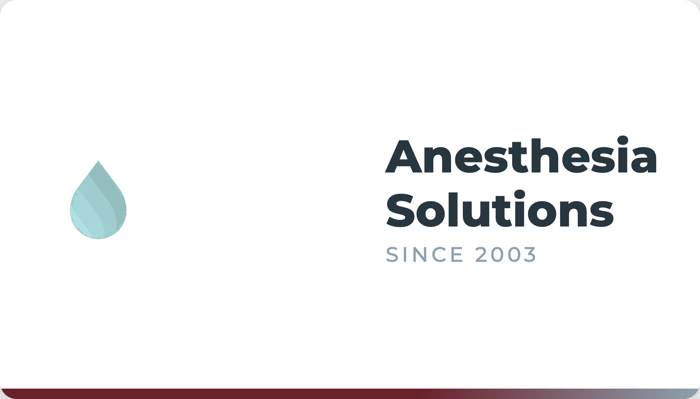

# Anesthesia Solutions — Business Card

Business card design for **Danielle Boggio**, CEO & Founder, CRNA.

## Print-Ready Files

| File | Description |
|------|-------------|
| `danielle-boggio-front.jpg` | Front side — 2016x1152px (576 DPI at 3.5"x2") |
| `danielle-boggio-back.jpg` | Back side — 2016x1152px (576 DPI at 3.5"x2") |
| `index.html` | Interactive HTML version (open in browser) |

## Preview

### Front

### Back

## Printing

Upload the JPEG files to VistaPrint (or your preferred printer) at standard business card size (3.5" x 2"). The images are rendered at 576 DPI — well above the 300 DPI minimum for sharp print output.

## Brand Colors

| Name | Hex |
|------|-----|
| Berry | `#6B212C` |
| Branch | `#685652` |
| Snowflake | `#DCE0E8` |
| Mist | `#8EA1AE` |
| Pine | `#27363F` |

## QR Code

The QR code on the back links to [anesthesia-solutions.com](https://www.anesthesia-solutions.com/).
